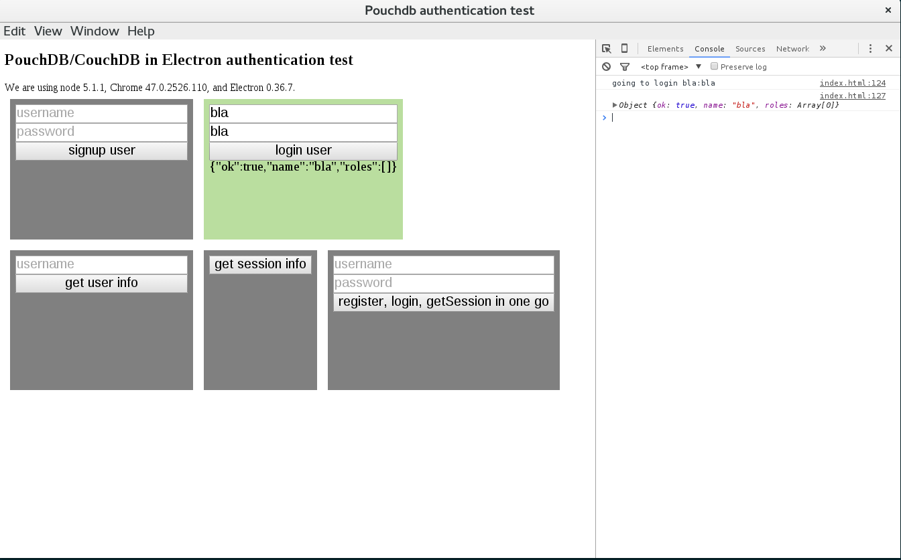

# pouchdb-authentication-electron-test



This is a minimal Electron application based on the [Quick Start Guide](http://electron.atom.io/docs/latest/tutorial/quick-start) within the Electron documentation.

I created this project to quickly check most of the pouchdb-authentication features.

## To Use
make sure you are running a couchDB or pouchDB on localhost:5984. Or change the line in index.html.
Also, additionally to npm you need bower to install *pouchdb*. If you don't want to use bower, you can download
*pouchdb* and *pouchdb-authentication* manually and accordingly change the paths in index.html.

Then:
```bash
# Install dependencies and run the app
npm install && npm start
```

Learn more about Electron and its API in the [documentation](http://electron.atom.io/docs/latest).

#### License [CC0 (Public Domain)](LICENSE.md)
